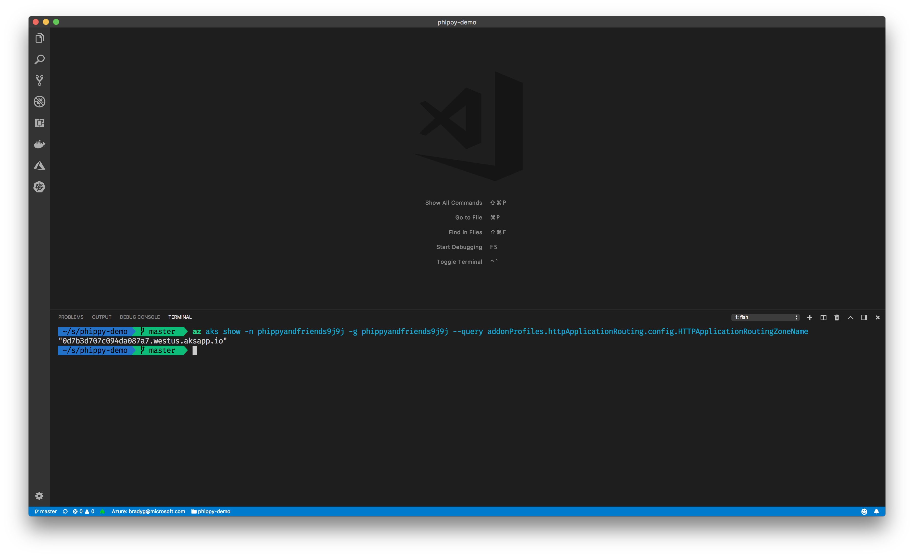
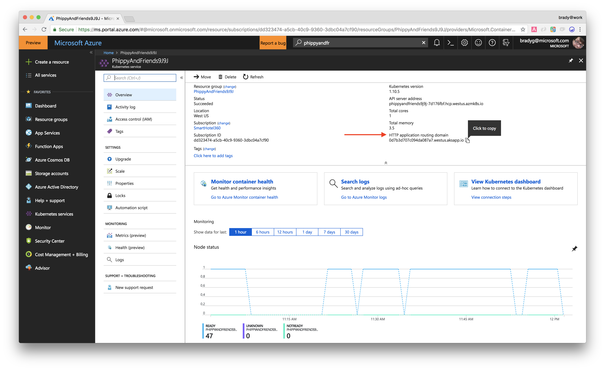
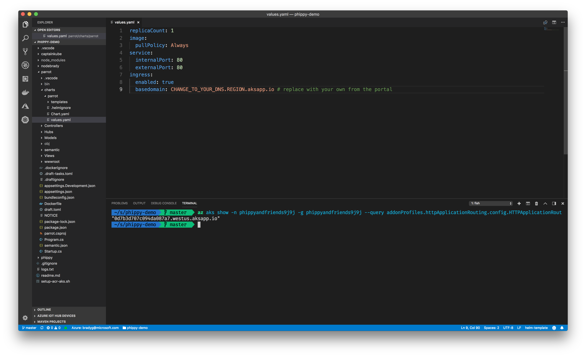
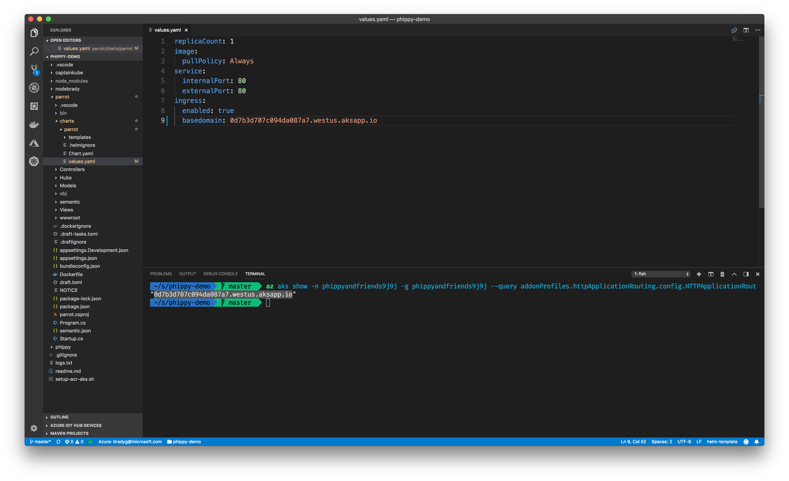
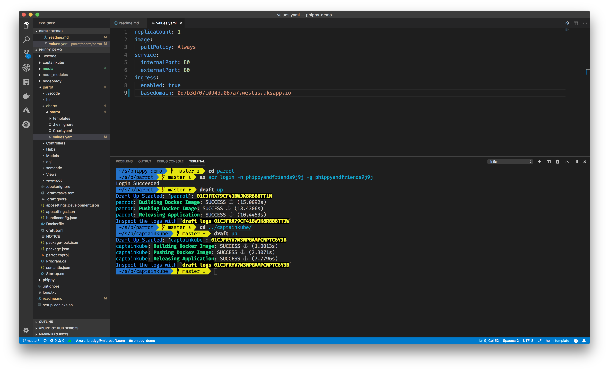
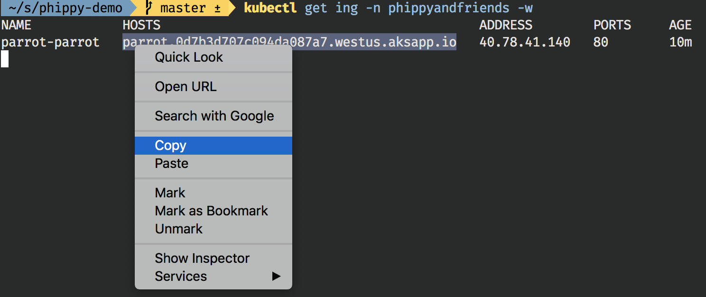
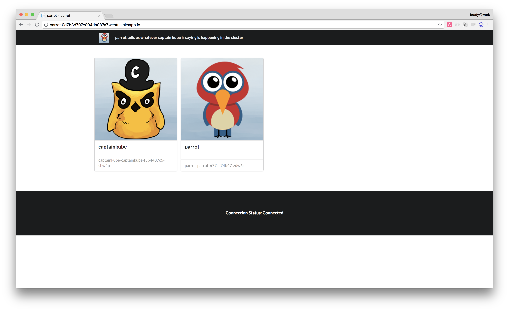
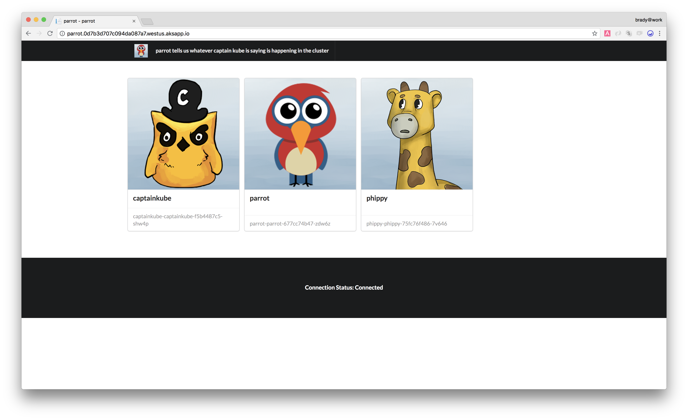
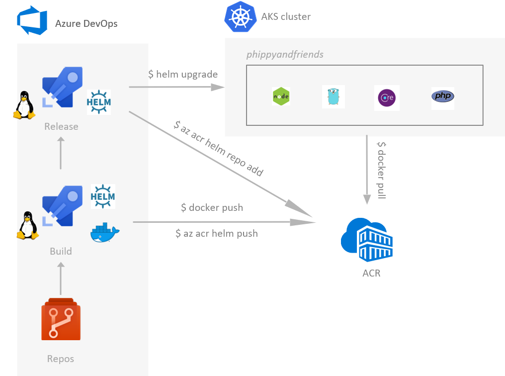

# Phippy and Friends

The [Children's Guide to Kubernetes](https://azure.microsoft.com/en-us/resources/videos/the-illustrated-children-s-guide-to-kubernetes/) is a simple, gentle answer a father gives his daughter, when she inquisitively asked about Kubernetes. It was written by [Matt](https://twitter.com/technosophos) [Butcher](http://technosophos.com/) on the [DEIS blog](https://deis.com/blog/2016/kubernetes-illustrated-guide/).

We loved the story and the imagery in it and thought the characters from the Illustrated Guide would make for an interesting demo. The demo has a few services, each of which represent an individual character in the story, as well as some we added. Each service is written in a different language, showing how the [Azure Kubernetes Service (AKS)](https://azure.microsoft.com/en-us/services/kubernetes-service/) cluster can run anything you can bring it. 

## Table of Contents
1. [Prerequisites](#prerequisites)
1. [Getting Started](#get-started)
    1. [Clone and open the code](#clone-and-open-the-code)
    1. [Get your public URL](#get-your-aks-ingress-url)
    1. [Connect to your Azure Container Registry](#connect-to-your-registry)
    1. [Deploy with Helm and Draft](#deploy-parrot-and-captain-kube-with-draft-and-helm)
1. [Validate Deployment](#validate-the-deployment)
    1. [Where is Phippy?](#but-where-is-phippy) 
    1. [Watch in real time](#watch-in-real-time)
    1. [Try scaling your apps](#try-scaling-your-apps)
1. [Leverage Azure DevOps](#leverage-azure-devops)
1. [Issues and Contributions](#issues)

--- 

## Prerequisites

Here's a short list of all the things you'll need to do. Don't worry - you'll be up and running in about thirty minutes.

1. An [Azure](https://azure.microsoft.com/en-us/free/) subscription. You can [Sign up for Free](https://azure.microsoft.com/en-us/free/) and see for yourself how Azure Kubernetes Service (AKS) is the best place for developers using Kubernetes. 
1. An Azure Kubernetes Service (AKS) Cluster, [enabled with Http Application Routing](https://docs.microsoft.com/en-us/azure/aks/http-application-routing) (this is **on** by default when you create a cluster via the Azure portal). 
    - *Important note: if your AKS cluster has RBAC enabled, you will need to run the following command to have `captainkube` able to read the information in the cluster: `kubectl create clusterrolebinding default-view --clusterrole=view --serviceaccount=phippyandfriends:default`.*
1. An Azure Container Registry instance (or a Docker Hub account if you prefer to use Docker Hub). If you opt to use Azure Container Registry, make sure you [configure RBAC access so that AKS has the proper role assignment to access your ACR](https://docs.microsoft.com/en-us/azure/container-registry/container-registry-auth-aks#grant-aks-access-to-acr).
1. You'll need to install a few tools handy for developing with containers and Kubernetes, and the Azure CLI:
    1. [The Azure CLI](https://docs.microsoft.com/en-us/cli/azure/?view=azure-cli-latest)
    1. [Helm](http://helm.sh) and [Draft](https://draft.sh/) are also required, as they enable deploying and debugging code in Kubernetes.
    1. [Visual Studio Code](http://code.visualstudio.com) and the [Kubernetes extension](https://marketplace.visualstudio.com/items?itemName=ms-kubernetes-tools.vscode-kubernetes-tools) for it would also be great to have. 

## Get Started! 

To get started, follow these simple steps. 

### Clone and Open the Code

The Phippy and Friends repository is public. Just clone it to your local machine and open the folder up in Visual Studio Code to get started. 

```bash
git clone https://github.com/Azure/phippyandfriends.git
cd phippy-demo
code .
```

### Get your AKS Ingress URL

A few of the services will provide HTML UIs. To enable external access, Ingress needs to be set up on each of these services using the external DNS of the cluster. Don't worry, though, this is easy. You can use VS Code's integrated terminal or the Cloud Shell tools in VS Code to run this `az` command line call, which will get your AKS cluster's external DNS.

```bash
az aks show -n <your cluster name> -g <your resource group name> --query addonProfiles.httpApplicationRouting.config.HTTPApplicationRoutingZoneName
```



You can also get the DNS from the Azure portal if you prefer. 



We'll be deploying the **parrot** service first (more on that in a moment), so let's take a look at the `values.yaml` file for parrot. The `values.yaml` file is where you can customize your service, release, deployment, and in our case, ingress settings. Find the `basedomain` property. 



Change the value of the `basedomain` property to match the DNS for your AKS cluster. 



### Connect to your Registry

If you want to select which registry to push to, use the command below:

```bash
draft config set registry <your Docker hub or Azure Container Registry>
```

If you're using ACR, you can also log into your registry using the Azure CLI. 

```bash
az acr login -n <your ACR instance name> -g <your ACR instance resource group>
```

### Deploy Parrot and Captain Kube with Draft and Helm

Now you'll create the first two services, **parrot** and **captainkube**. 

1. The captainkube service, a simple Go app, is represented by Captain Kube from the Children's Illustrated Guide to Kubernetes. This service constantly watches the pods running in the Kubernetes cluster. Whenever a pod is activated, updated, or deleted from the cluster, captainkube tells the parrot service what just happened. 
1. The parrot service is essentially an ASP.NET Core app with a Web API back-end. The Web API bubbles events up to the HTML client via a SignalR Hub. Parrot essentially "parrots" what captainkube is telling him in the form of [Semantic UI](http://semantic-ui.com) cards on the UI side. When services pop into the cluster, they're represented by characters shown in the cards. 

These two baseline services need to be running first, so you can Draft them up into the cluster using the commands below. 

```bash
cd parrot
draft up
cd ..
cd captainkube
draft up
cd ..
```

You'll be provided feedback as the deployment takes place. 



## Validate the Deployment

Once the deployment has completed, enter this Kubernetes CLI command to see everything you've deployed into the cluster. 

```bash
kubectl get svc,pod,ing --namespace phippyandfriends
```

You should see something like this in your terminal window. 

```bash
NAME            TYPE        CLUSTER-IP     EXTERNAL-IP   PORT(S)   AGE
parrot-parrot   ClusterIP   10.0.224.230   <none>        80/TCP    3m

NAME                                      READY     STATUS    RESTARTS   AGE
captainkube-captainkube-f5b4487c5-shw4p   1/1       Running   0          3m
parrot-parrot-677cc74b47-zdw6z            1/1       Running   0          3m

NAME            HOSTS                                          ADDRESS        PORTS  
parrot-parrot   parrot.0d7b3d707c094da087a7.westus.aksapp.io                  80     
```

It may take a few minutes for the ingress DNS to be matched up to the public IP address for the cluster. If you don't see an IP address listed for the `parrot` service, just type this command and watch the terminal window update automatically until you have a public IP address for the ingress. 

```bash
kubectl get ing --namespace phippyandfriends -w
```

Eventually, your ingress will reflect the public IP address, which is your sign that parrot's DNS will work. So copy it from the terminal window. 



Drop parrot's ingress URI into a web browser and you'll see the dashboard, which confirms you've got two services - parrot and captainkube - running in your cluster. 



### But where is Phippy? 

The Phippy service is a super-simple PHP app. 

Next, CD into the phippy directory, as we definitely want to make sure we deploy our star of the show, Phippy, into our AKS cluster. Use the same `draft up` command as you did for parrot and captainkube, and you'll see the phippy service's deployment status as it occurs. 

The moment the deployment finishes, the dashboard will light up with Phippy!



### Watch in Real-time

The final service is a basic Node.js application represented by the Node.js-decorated [Azure Brady, the Open Cloud Ninja Sloth](https://github.com/Microsoft/OpenCloudNinjaSloth). 

You can cd into this service's folder and deploy it using `draft up` as you did with the others. But for fun, do this in a window that's side-by-side with the parrot dashboard. This way you can see services appear as you `draft up` and vanish as you `draft delete`. 

### Try Scaling your Apps

Scale your nodebrady by running this:

```bash
kubectl scale deployment/nodebrady-nodebrady --replicas 3 --namespace phippyandfriends
```

Watch as more brady ninjas come to life!

## Leverage Azure DevOps

You could also leverage [Azure DevOps](https://docs.microsoft.com/azure/devops) to implement a [CI/CD pipeline](https://docs.microsoft.com/azure/devops/pipelines) for each app. For that you could [create Azure build pipelines](https://docs.microsoft.com/azure/devops/pipelines/get-started-yaml#get-your-first-build) per app for both Build/CI and Release/CD by using the associated YAML definitions: 
- [captainkube/ci-pipeline.yml](captainkube/ci-pipeline.yml) and [captainkube/cd-pipeline.yml](captainkube/cd-pipeline.yml)
- [nodebrady/ci-pipeline.yml](nodebrady/ci-pipeline.yml) and [nodebrady/cd-pipeline.yml](nodebrady/cd-pipeline.yml)
- [parrot/ci-pipeline.yml](parrot/ci-pipeline.yml) and [parrot/cd-pipeline.yml](parrot/cd-pipeline.yml)
- [phippy/ci-pipeline.yml](phippy/ci-pipeline.yml) and [phippy/cd-pipeline.yml](phippy/cd-pipeline.yml)



For more information, you could follow this tutorial: [Using Azure DevOps to setup a CI/CD pipeline and deploy to Kubernetes](https://open.microsoft.com/2018/11/27/tutorial-azure-devops-setup-cicd-pipeline-kubernetes-docker-helm).

## Issues?

Phippy and Friends is open-source, and we'd love your contributions. Submit issues, then work those issues and send us a pull request. Customize the parrot dashboard with a theme, put the characters on a boat, launch them into space. We'd love to see what other characters you'll add to the dashboard!

### Troubleshooting

Sometimes a previous deployment would fail and you would receive a message like so:

```sh
error while releasing: could not upgrade release: rpc error: code = Unknown desc = "parrot" has no deployed releases
```

if that happens, you need to delete that failed deployment by running the following command, replacing `parrot` with the failed deployment name:

```sh
helm uninstall parrot -n phippyandfriends
```

## Credits

Some awesome people worked on the Phippy and Friends demo. [Stella Lin]() brought the idea to [Brady Gaster](), who then got a **ton** of help from [Ralph Squillace]() and [Ahmed Sabbour](http://twitter.com/sabbour) to bring it to life and [Mathieu Benoit](http://github.com/mathieu-benoit) for his Azure DevOps pipelines. As mentioned earlier, Phippy and Friends was originally inspired by a blog post written by [Matt](https://twitter.com/technosophos) [Butcher](http://technosophos.com/). Phippy and friends were conceived by Matt Butcher, Karen Chu, and Bailey Beougher and are licensed by the CNCF under the CC-BY license. More info at [phippy.io](http://phippy.io). Goldie the Gopher is based on the Go Gopher by Renee French.


You can help too, by submitting a pull request and adding your own contributions. When you do, make sure to add your contributions' summary to this section, too!
